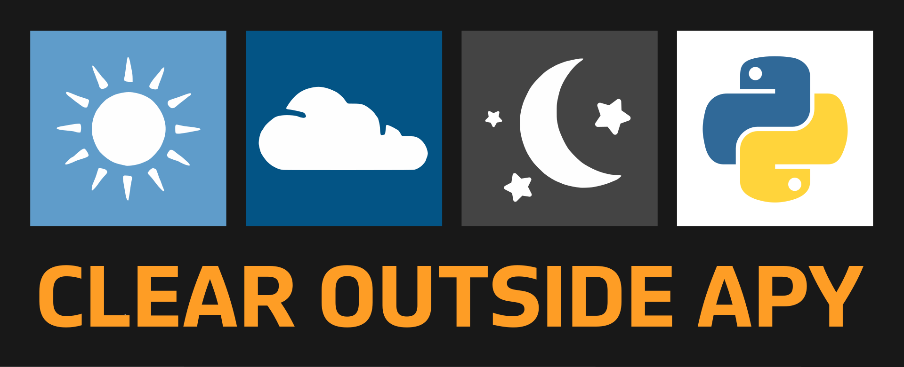

# ClearOutsideAPY

[](https://pypi.org/project/clear-outside-apy/)
 




## Web scraper / parser for ClearOutside.com

Python module that downloads a [clearoutside.com](https://clearoutside.com)
forecast page and parses the 7-day hourly astronomy weather table.

Version 2.0 is a C extension. There are no BeautifulSoup / html5lib /
requests dependencies. Parsing a full page is typically 1–2 milliseconds;
the remaining time is the HTTP round-trip.

A compiler is required **to build from source**. PyPI wheels ship the
already-compiled extension.

## Installation

From [PyPI](https://pypi.org/project/clear-outside-apy/):

```
pip install clear-outside-apy
```

From the repo:

```
pip install git+https://github.com/TheElevatedOne/ClearOutsideAPY.git
```

Building a wheel / tarball for upload:

```
./build.sh
python -m twine upload dist/*
```

On Linux, `./build.sh` runs [auditwheel](https://github.com/pypa/auditwheel)
so the wheel is tagged `manylinux_*` (PEP 600). PyPI rejects the older
`linux_x86_64` platform tag. You need `patchelf` installed for that step.
macOS (`macosx_*`) and Windows (`win_amd64`) tags are accepted as-is.

For portable wheels across Python versions, use
[cibuildwheel](https://cibuildwheel.pypa.io/) (config is in `pyproject.toml`).

## Usage

```python
from clear_outside_apy import ClearOutsideAPY

api = ClearOutsideAPY("43.16", "-75.84", view="midday")
api.update()          # download again
result = api.pull()   # parse; returns a dict
```

`lat` and `long` may be `str`, `int`, or `float`. They are formatted to two
decimal places, which is what the site uses.

```
lat = "43.16", long = "-75.84"  ->  New York area
https://clearoutside.com/forecast/43.16/-75.84
```

- `view`
  - `midday` — first column is 12:00
  - `midnight` — first column is 00:00
  - `current` — first column is the current local hour
- `experimental=True` — also fetch Met.no and 7Timer extra rows
- `metric=True` (default) — visibility, wind speed, and moon distance in km
- `lon=` is accepted as a keyword alias for `long`

One-shot helper and HTML parser (no download):

```python
from clear_outside_apy import fetch_forecast, parse

result = fetch_forecast(43.16, -75.84, view="current")
result = parse(open("forecast.html", "rb").read())
```

CLI:

```
clear-outside-apy 43.16 -75.84 --view midday
python -m clear_outside_apy 43.16 -75.84 --experimental
```

## Output

**Default units are metric, 24-hour clock.**

| Field | Unit |
| --- | --- |
| Date | `dd/MM/yy` |
| Sky brightness | millicandela / m² (`mcd/m2`) |
| Artificial brightness | microcandela / m² (`ucd/m2`) |
| Visibility | kilometres (`None` when the site has `-`) |
| Precipitation | millimetres |
| Wind speed | kilometres / hour |
| Wind direction | compass name + degrees |
| Temperature | °C |
| Pressure | millibars |
| Ozone | Dobson units |
| Moon distance | kilometres |

Pass `metric=False` to keep the site's miles / mph for distance and wind.

The full dict is large (7 days × 24 hours). A captured example lives in
[example/example-result.json](example/example-result.json). Shape:

```python
{
  "location": {
    "name": "Oneida Lake Beach West, Madison, United States of America",
    "latitude": "43.16",
    "longitude": "-75.84"
  },
  "url": "https://clearoutside.com/forecast/43.16/-75.84?view=midday",
  "view": "midday",
  "experimental": False,
  "units": { "visibility": "km", "wind-speed": "km/h", "...": "..." },
  "gen-info": {
    "last-gen": { "date": "14/09/26", "time": "04:09:45" },
    "forecast": { "from-day": "14/09/26", "to-day": "20/09/26" },
    "timezone": "UTC-4.00"
  },
  "sky-quality": {
    "magnitude": 21.3,
    "bortle_class": 4,
    "brightness": { "value": 0.33, "unit": "mcd/m2" },
    "artif-brightness": { "value": 155.5, "unit": "ucd/m2" }
  },
  "forecast": {
    "day-0": {
      "date": { "long": "Monday", "short": "14" },
      "sun": {
        "rise": "06:42", "set": "19:16", "transit": "12:58",
        "civil-dark": ["19:44", "06:14"],
        "nautical-dark": ["20:18", "05:40"],
        "astro-dark": ["20:53", "05:05"]
      },
      "moon": {
        "rise": "10:38", "set": "20:07",
        "phase": { "name": "Waxing Crescent", "percentage": 8 },
        "meridian": {
          "time": "14:53", "date": "13/09/2026",
          "altitude": 33.0, "distance": 388599.37, "distance-unit": "km"
        }
      },
      "hours": {
        "12": {
          "conditions": "ok",
          "total-clouds": 45,
          "low-clouds": 35,
          "mid-clouds": 0,
          "high-clouds": 1,
          "visibility": None,
          "fog": None,
          "prec-type": "none",
          "prec-probability": 0,
          "prec-amount": 0.0,
          "wind": { "speed": 9.66, "direction": "west-south-west", "degrees": 258 },
          "frost": "none",
          "temperature": { "general": 25, "feels-like": 27, "dew-point": 20 },
          "rel-humidity": 72,
          "pressure": 1012,
          "ozone": 309,
          "iss": None
        }
      }
    }
  }
}
```

ISS hours look like:

```python
"iss": {
  "start": { "time": "20:36:19", "direction": "W", "altitude": 10 },
  "max":   { "time": "20:39:19", "direction": "NNW", "altitude": 29 },
  "end":   { "time": "20:41:59", "direction": "NE", "altitude": 12 },
  "magnitude": -1.6
}
```

With `experimental=True` each hour also has `extra.metno` and `extra.timer`
(7Timer cloud cover, seeing, lifted index, transparency).

## Exceptions

- `InvalidLocationError` — bad latitude / longitude / view
- `FetchError` — HTTP or network failure
- `ParseError` — HTML is not a Clear Outside forecast page
- `ClearOutsideError` — base class for all of the above
